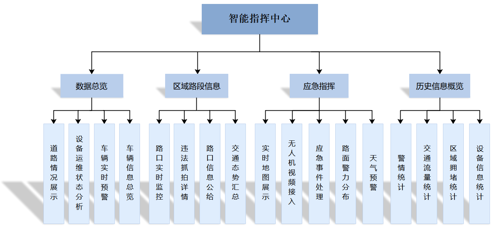
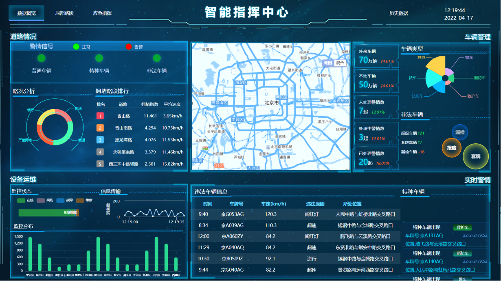
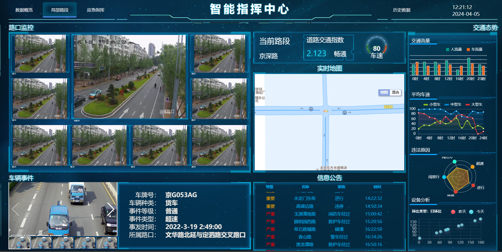
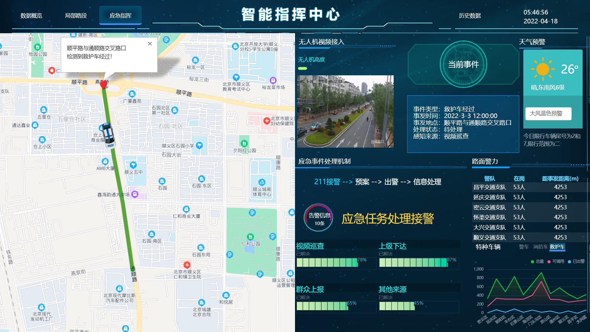
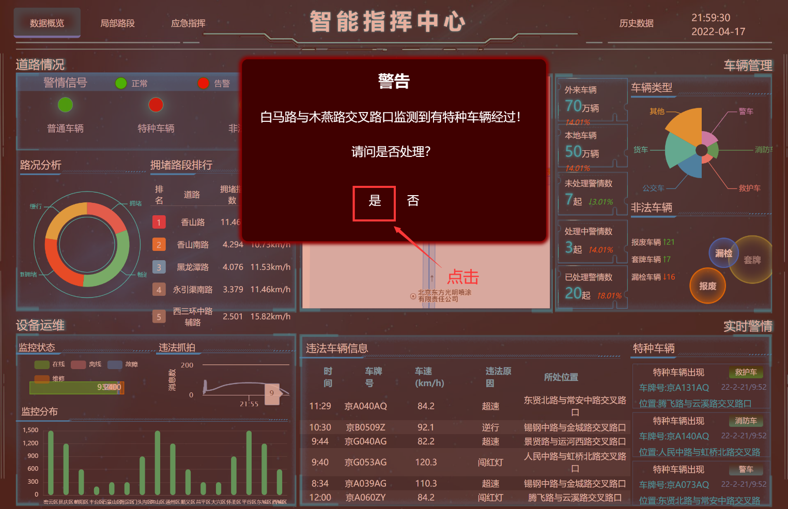
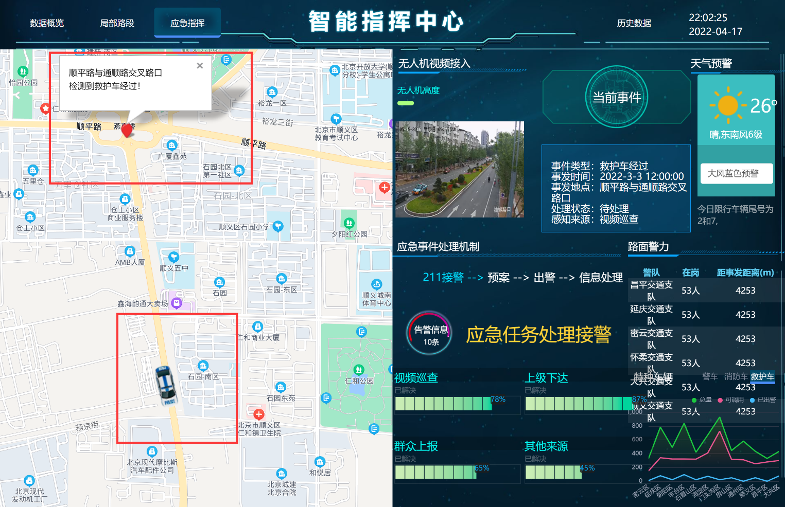
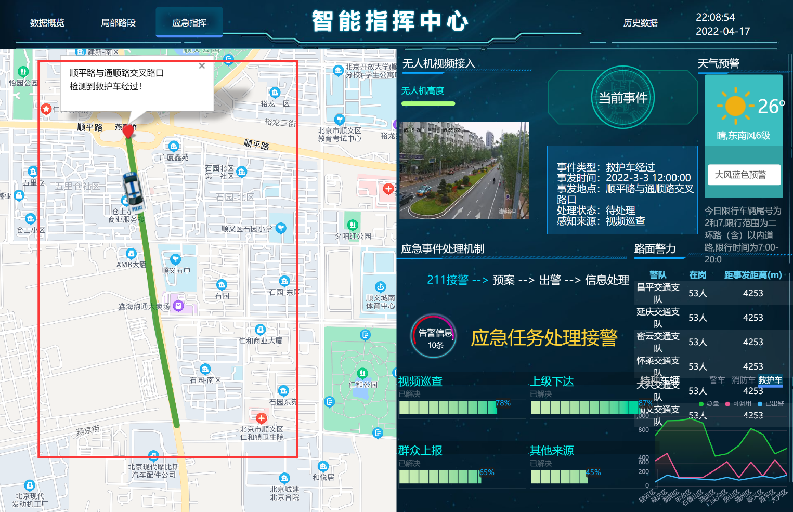
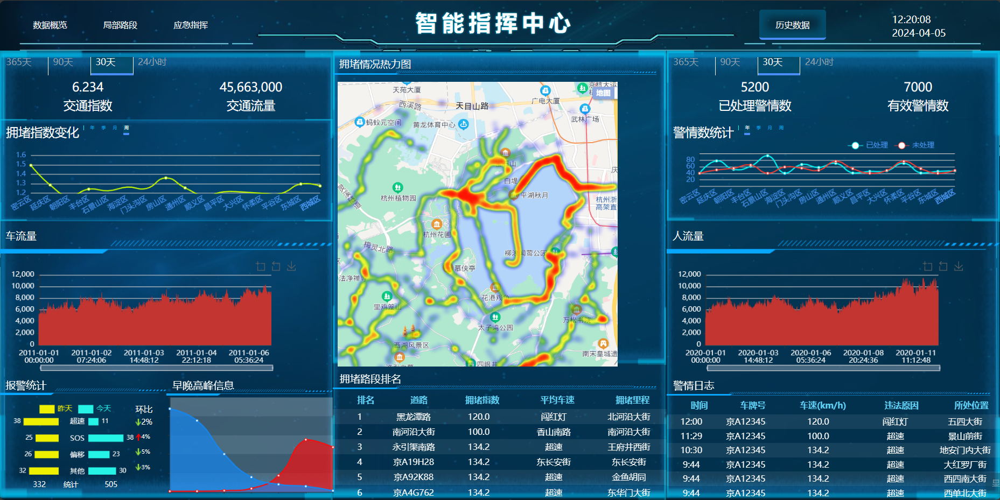

<h1 align="center" style="margin: 30px 0 30px; font-weight: bold;">智能交通指挥平台 v1.0</h1>
<h4 align="center">基于Vue+Echarts开发的可视化大屏</h4>

## 平台简介

智能交通指挥平台，采用vue框架，智能识别交通监控视频，获取车流量等交通数据，进行可视化展示，识别出违法车辆、救援车辆，为救援紧急车辆开放绿色通道。项目获第十三届服务外包创新创业大赛**国家级二等奖**，授权软件著作权一项。

平台目前已经实现数据概览、局部路段、应急指挥、历史数据等功能模块。

* 应用框架基于[vue](https://cn.vuejs.org/guide/introduction.html)。
* 前端组件采用[element-ui](https://www.uihtm.com/element/#/zh-CN)，全端兼容的高性能UI框架。
* [Echarts](https://echarts.apache.org/zh/index.html)展示多种多种图表。
* 基于百度地图API二次开发，实现为救援车辆开放绿色通道功能。

## 功能模块

#### 数据总览
1. 道路情况展示 
    管理员选择某一条指定道路，展示该道路的实时情况。
2. 设备运维状态分析 
    所有设备列表一览，显示运维状态和分析结果。
3. 车辆实时预警 
    车辆出现需要预警的情况，管理员在平台上收到预警信息并确认。
4. 车辆信息总览 
    管理员查看车辆列表和指定车辆的所有信息。

#### 区域路段信息
1. 路口实时监控 
    管理员选择指定路口查看实时监控录像。
2. 违法抓拍详情 
    管理员选择违法记录，查询违法抓拍详情。
3. 路口信息公告 
    管理员对路口展示的信息公告进行添加、修改、撤销等管理操作。
4. 交通态势汇总 
    汇总统计交通数据的大体趋势并显示。

#### 应急指挥
1. 实时地图展示 
    动态展示实时地图。
2. 无人机视频接入 
管理员通过功能选项调用无人机视频接入接口，查看所有无人机拍摄视频。
3. 应急事件处理 
    管理员在平台接收并查看应急事件提醒消息，及时处理消息。
4. 路面警力分布 
    管理员和交管部门能够查看各个路口和道路警力执勤的分布情况。
5. 天气预警 
    极端天气情况时系统自动进行预警消息，提醒交管部门和管理员进行提前部署、人工干预等措施。

#### 历史信息概览
1. 警情统计 
    记录并统计历史警情信息，供交管部门和管理员查询
2. 交通流量统计 
    记录并统计历史交通流量，并形成数据报表和变化趋势，供交管部门和管理员查询和分析
3. 区域拥堵统计 
    记录并统计历史不同区域拥堵情况，供交管部门和管理员查询和分析，同时供疏导算法基于历史信息实时调整，生成动态疏导策略。
4. 设备信息统计 
    管理员查看设备列表和设备相关信息统计结果。

## 演示图

### 数据概览
  

 1. **自定义信号组件：**
    动态切换颜色 + 闪烁效果，直观显示警情信号
 2. **动态表格：**
    滚动播放，实时更新最新警情
 3. **Echarts实现多种图表：**
    * 环形图：路况拥堵情况分析
    * 南丁格尔玫瑰图：车辆类型分析
    * 堆叠条形图：设备运维状态分析
    * 动态折线图：信息实时传输情况
    * 圆角柱状图：监控区域分布

### 区域路段信息
 

 1. **路口周边监控播放：**
   选择指定路口查看实时监控录像
 2. **违法抓拍图片轮播切换：**
    展示违法车辆信息
 3. **Echarts实现多种图表：**
      * 仪表盘：路口车速实时显示
      * 雷达图：违法原因类型分析
      * 散点图：日环比
      * 曲线图：24小时路口车速统计
      * 柱状图：24小时交通流量统计

### 应急指挥
 

1. **基于百度地图API 开发：**
    载入百度地图，添加地图控件。
    选择路口位置，获取地点信息。
    自定义添加标注，开放绿色通道。
2. **小屏控制大屏：**
    支持管理员操作小屏端，
    地图上添加标注，开放绿色通道，
    操作结果同步展示到大屏上。
3. **打字机效果：**
    天气预警提示文字的显示
4. **Echarts实现多种图表：**
   * 折线面积图：特种车辆数量分布
   * 堆叠条形图：任务处理进度

### 应急事件处理流程
* 功能说明：
    管理员在平台接收并查看应急事件提醒消息，可以在受理信息后进入小屏控制界面，手动操作系统，为特种车辆放行。
* 操作说明：
    大屏端会弹出应急事件警告,点击进入应急事件发生路段界面,查看车辆所在路口和行驶方向,操作信号灯为特种车辆放行。

1. 大屏端会弹出应急事件警告时，点击是即可进入应急事件发生路段界面
    
2. 可以在应急事件所发生的路段查看车辆所在路口和行驶方向
    
3. 在小屏端点击对应需要变更为绿灯的路口，即可为特种车辆开辟绿色通道，在大屏端也可以清楚地看到绿色通道的开辟状态。
    
    

### 历史数据
 

**Echarts实现多种图表：**
* 动态联动折线图：拥堵指数变化情况统计，警情数变化情况统计
* 百度地图结合热力图：展示路口拥堵情况
* 大数据时间轴折线图：时间轴缩放显示历史交通流量
* 交错正负轴柱状图：警情对比分析
* 平滑折线面积图：早晚高峰车流量信息

## 开发
        # 克隆项目
        git clone https://github.com/QJC1123/traffic-control-system

        # 进入项目目录
        cd traffic-control-system

        # 安装依赖
        npm install

        # 启动服务
        npm run dev

